# itis_devops_finish_work

Итоговая работа:
* запаковать ваше любое веб приложение в контейнеры с использованием compose/minikube
* обеспечить логирование вашего приложения (loki/elasticksearch/clickhouse любой продукт на выбор даже не из списка, главное чтобы поддерживался как источник данных в grafana)
* сделать возможность просмотров ваших логов через grafana
* сборка зависимостей кода должна быть описана через multistage если зависимости имеются
* сборка и развертывание контейнеров должно быть реализовано через bash скрипты. Скрипты должны иметь параметр запуска -t который задает тег образа который будет собран или запущен

Результатом должно быть:
* работоспособное приложение, и все его зависимости для запуска в контейнере собранные репозитории
* readme.md с КОРОТКИМ описанием приложения, инструкцией по запуску скрипта, скрины рабочего варианта приложения, скрины которые показывает что логирование работает и скрины логов из grafana

###

## Dockerfile

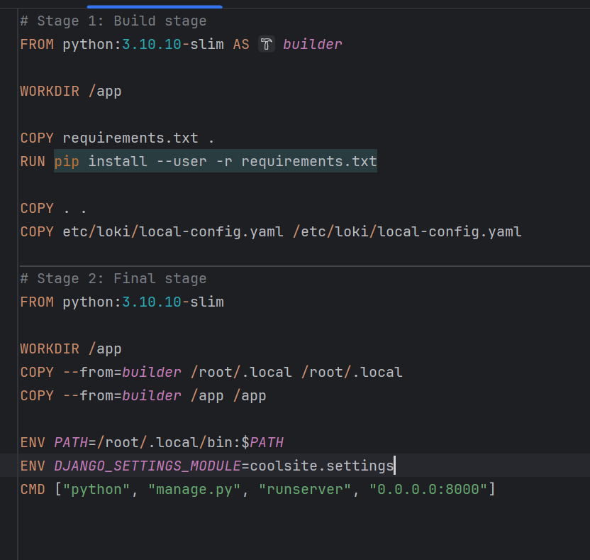

- Сборка зависимостей на стадии сборки.
- Перенос зависимостей и кода на финальную стадию.
- Настройка окружения и запуск Django-приложения.

## docker-compose.yml

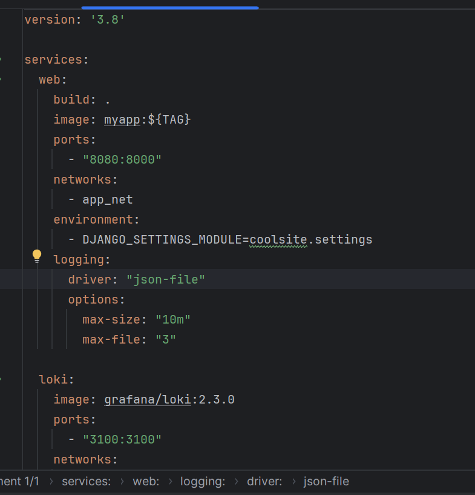
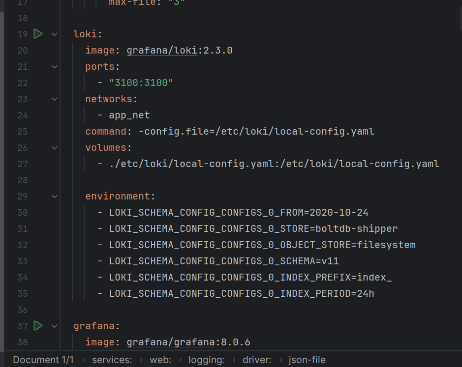
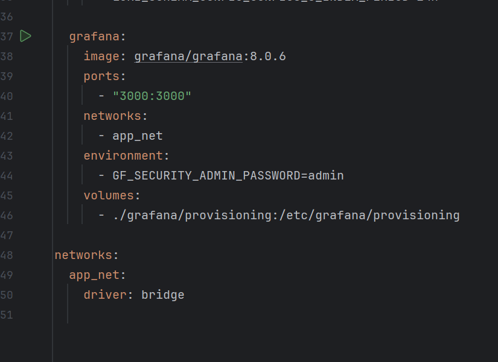

- Сборка и запуск веб-приложения.
- Настройка Loki для сбора логов.
- Настройка Grafana для визуализации логов из Loki.

## grafana/provisioning/datasources/loki.yaml

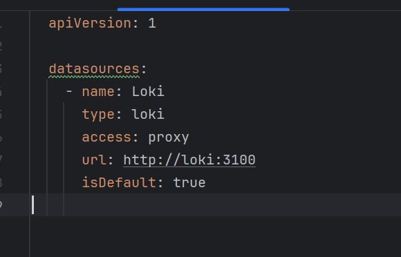

- Этот YAML файл настраивает Loki как источник данных в Grafana:
- Grafana будет использовать Loki для сбора и отображения логов.

## build.sh

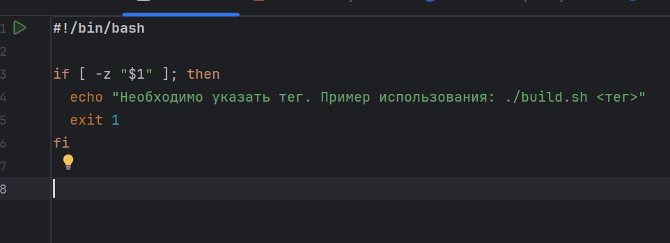

- Убеждаемся, что пользователь передал необходимый аргумент (тег) при запуске скрипта. Если тег не передан, скрипт выводит подсказку и завершает работу

## run.sh

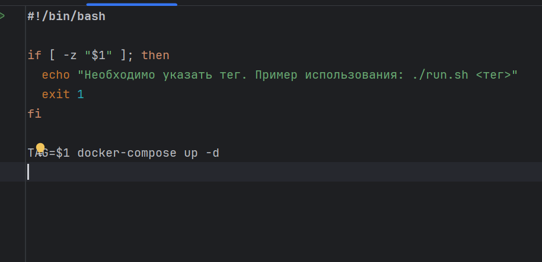

- запуск Docker Compose с указанным тегом для сборки и запуска контейнеров в фоновом режиме.

### запускаем 
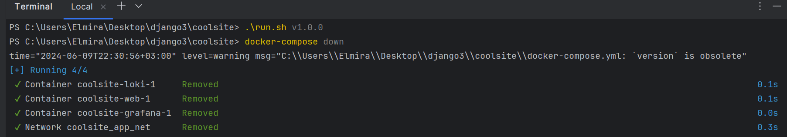

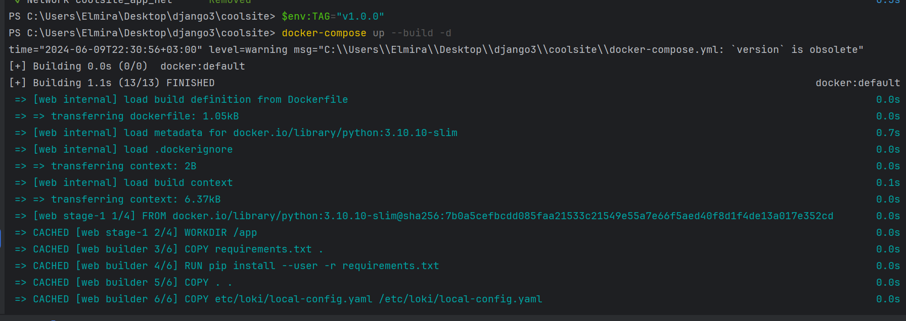

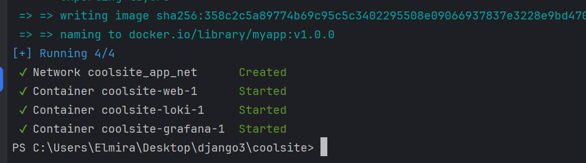

### контейнер

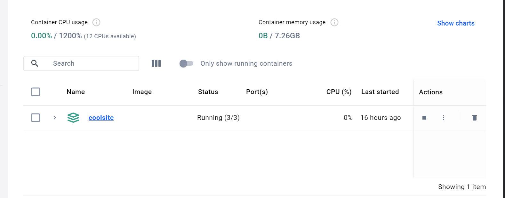

### образы 

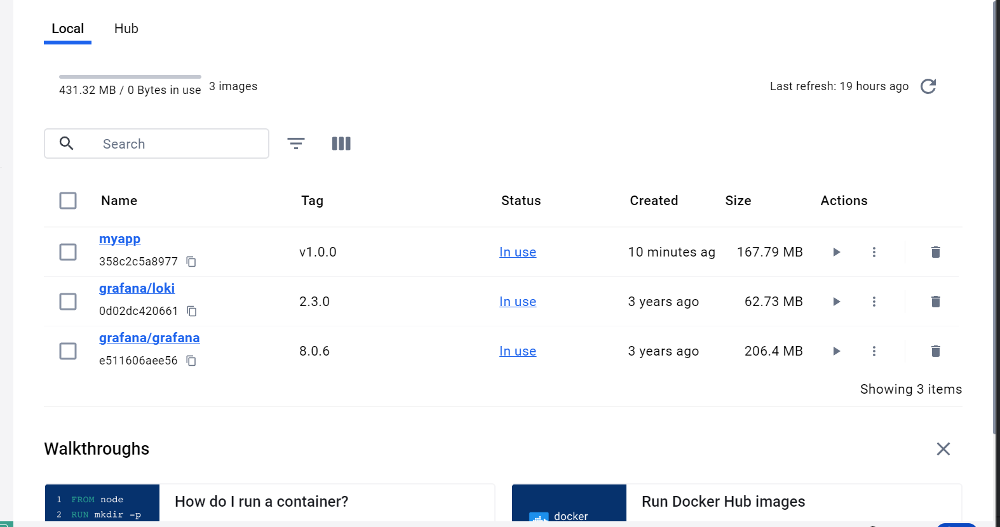

### сайт
-- все работает как и раньше
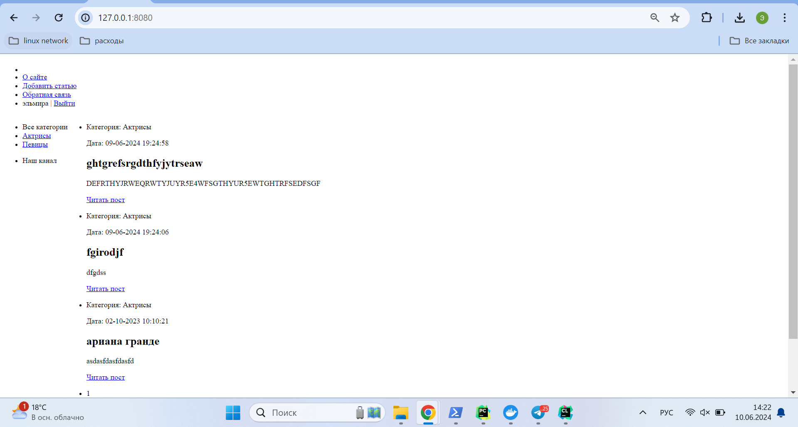

### Loki

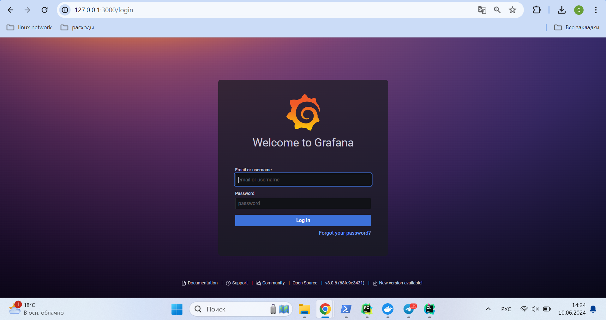

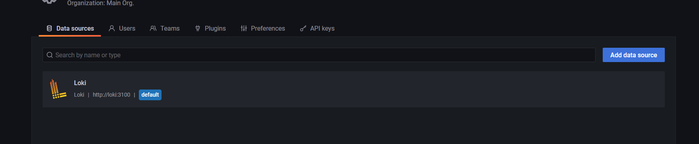

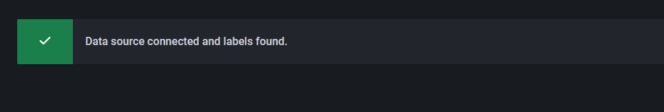

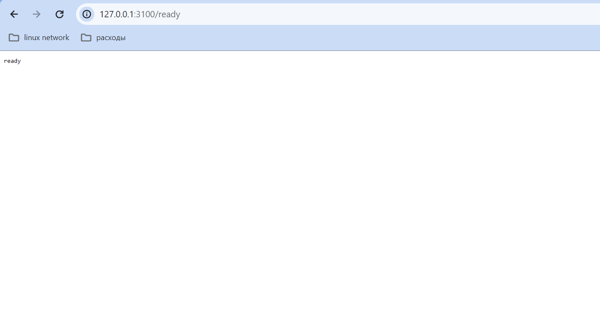

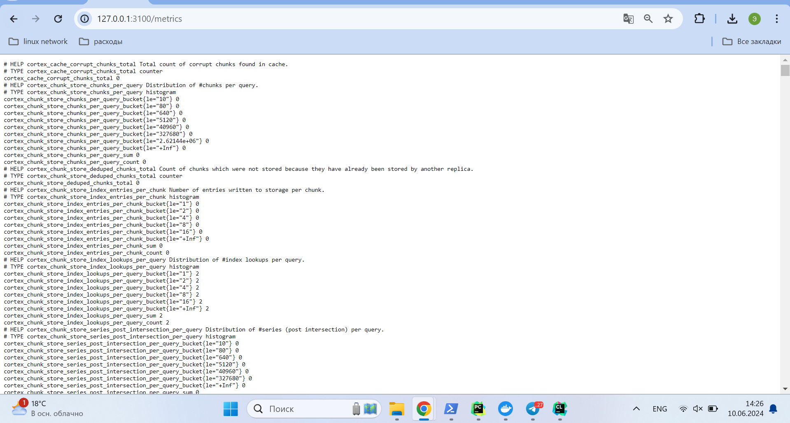

